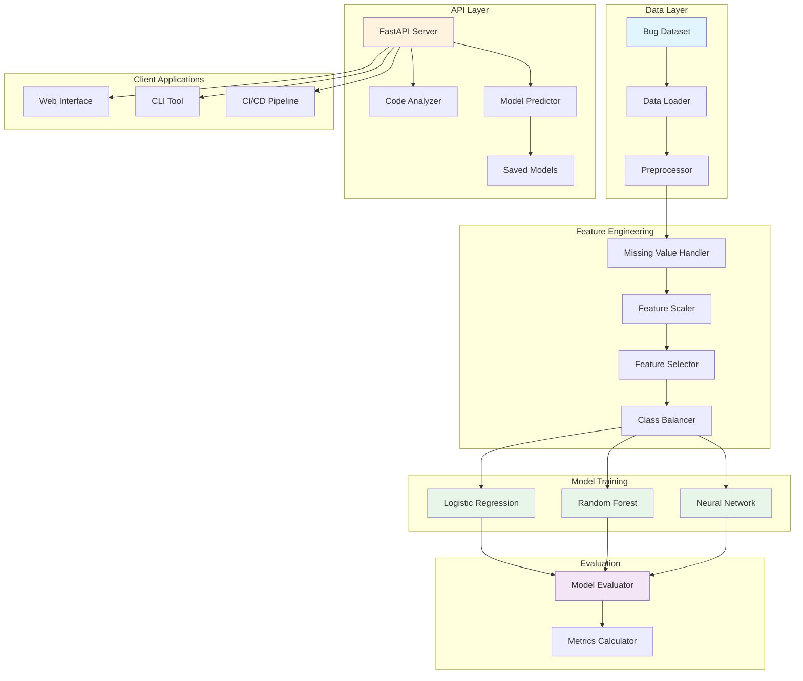
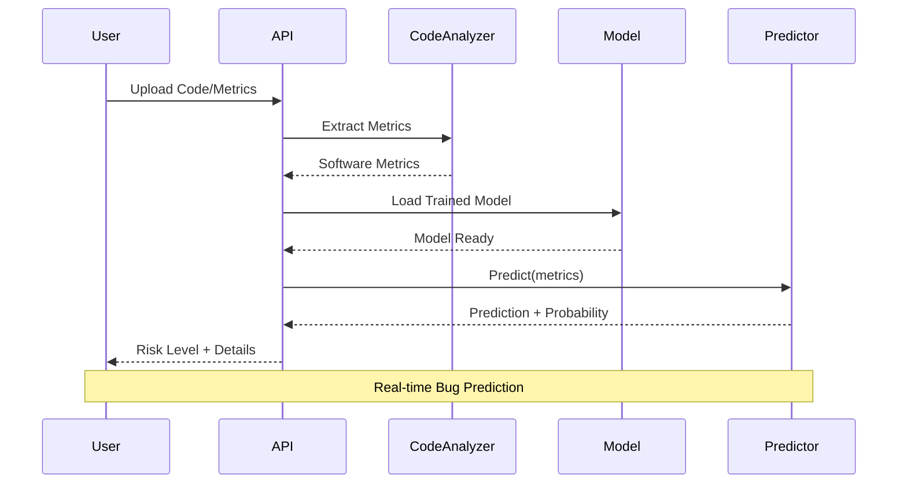
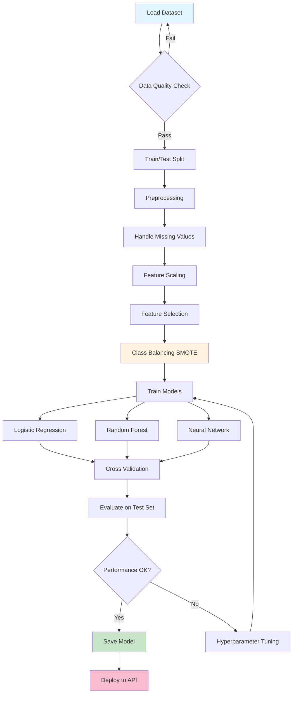
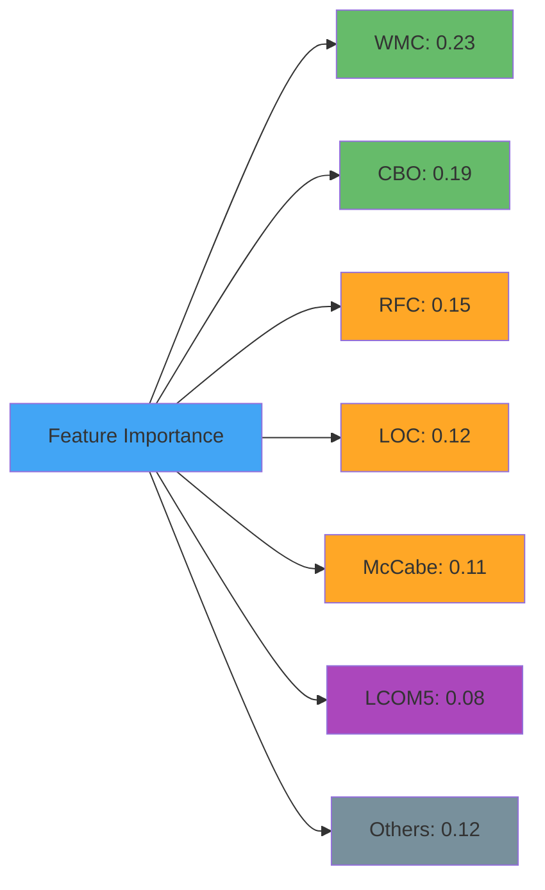
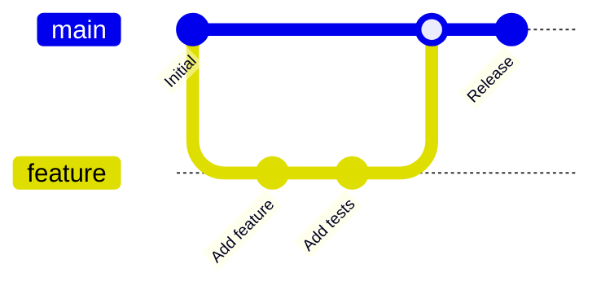

# 🐛 AI-Powered Bug Prediction System

<div align="center">


**Predict software bugs before they happen using machine learning and static code analysis**

[Features](#-features) • [Installation](#-installation) • [Quick Start](#-quick-start) • [API Documentation](#-api-documentation) • [Models](#-models)

</div>

---

## 📋 Table of Contents

- [Overview](#-overview)
- [Features](#-features)
- [Architecture](#-architecture)
- [Installation](#-installation)
- [Quick Start](#-quick-start)
- [API Documentation](#-api-documentation)
- [Models](#-models)
- [Usage Examples](#-usage-examples)
- [Project Structure](#-project-structure)
- [Technologies](#-technologies)
- [Contributing](#-contributing)
- [License](#-license)

---

## 🎯 Overview

The **AI-Powered Bug Prediction System** is an advanced machine learning platform that predicts potential bugs in software code by analyzing various software metrics. The system helps development teams:

- 🎯 **Identify high-risk code** before bugs occur
- 📊 **Prioritize code reviews** based on risk levels
- 🚀 **Improve code quality** through proactive analysis
- 💰 **Reduce maintenance costs** by catching bugs early

### Key Highlights

- **Multiple ML Models**: Logistic Regression, Random Forest, Neural Networks
- **REST API**: Production-ready FastAPI server
- **Real-time Analysis**: Analyze code snippets on-the-fly
- **Batch Processing**: Process multiple files efficiently
- **Risk Scoring**: Categorize files by risk level (LOW, MEDIUM, HIGH, CRITICAL)

---

## ✨ Features

### 🤖 Machine Learning Models

- **Logistic Regression**: Fast, interpretable baseline model
- **Random Forest**: High accuracy ensemble model with feature importance
- **Neural Network**: Deep learning model with advanced pattern recognition

### 📊 Code Analysis

- Extract 10+ software metrics automatically
- Support for Java and Python code
- Metrics include: LOC, Cyclomatic Complexity, Coupling, Cohesion, and more

### 🌐 REST API

- RESTful endpoints for predictions
- Single file and batch processing
- CSV file upload and download
- Interactive Swagger documentation

### 📈 Evaluation & Visualization

- Comprehensive metrics (Accuracy, Precision, Recall, F1, ROC-AUC)
- Confusion matrices and ROC curves
- Feature importance visualization
- Model comparison tools

---

## 🏗️ Architecture



### System Workflow



---

## 🚀 Installation

### Prerequisites

- Python 3.8 or higher
- pip package manager
- Virtual environment (recommended)

### Step 1: Clone the Repository

```bash
git clone https://github.com/yourusername/bug-prediction-system.git
cd bug-prediction-system
```

### Step 2: Create Virtual Environment

```bash
# Windows
python -m venv venv
venv\Scripts\activate

# Linux/Mac
python3 -m venv venv
source venv/bin/activate
```

### Step 3: Install Dependencies

```bash
pip install -r requirements.txt
```

### Step 4: Download Dataset (Optional)

```bash
python core/dataset.py
```

---

## 🎬 Quick Start

### Training Models

```bash
# Train all models
python pipeline/trainer.py --model all

# Train specific model
python pipeline/trainer.py --model rf --epochs 100

# With feature selection
python pipeline/trainer.py --model nn --select-features --k-features 15
```

### Running the API Server

```bash
# Start FastAPI server
python app/fastapi.py --model models/random_forest_model.pkl --port 8000

# With auto-reload (development)
python app/fastapi.py --reload
```

The API will be available at:
- **API**: http://localhost:8000
- **Swagger Docs**: http://localhost:8000/docs
- **ReDoc**: http://localhost:8000/redoc

### Making Predictions

#### Using Python

```python
from pipeline.evaluator import ModelEvaluator

# Load model
evaluator = ModelEvaluator("models/random_forest_model.pkl")

# Predict from metrics
metrics = {
    'LOC': 150,
    'WMC': 12,
    'CBO': 5,
    'RFC': 25,
    'LCOM5': 0.3,
    'DIT': 2,
    'NOC': 0,
    'McCabe': 8,
    'NOS': 50
}

result = evaluator.predict_from_metrics(metrics)
print(f"Prediction: {result['prediction']}")
print(f"Bug Probability: {result['bug_probability']:.2%}")
print(f"Risk Level: {result['risk_level']}")
```

#### Using cURL

```bash
# Single file prediction
curl -X POST "http://localhost:8000/predict" \
  -H "Content-Type: application/json" \
  -d '{
    "file_name": "MyClass.java",
    "metrics": {
      "LOC": 150,
      "WMC": 12,
      "CBO": 5,
      "RFC": 25,
      "LCOM5": 0.3
    }
  }'
```

---

## 📚 API Documentation

### Core Endpoints

```mermaid
graph LR
    A[API Endpoints] --> B[Prediction]
    A --> C[Model Management]
    A --> D[Metrics]
    A --> E[Health]
    
    B --> B1[/predict - Single]
    B --> B2[/predict/batch - Multiple]
    B --> B3[/predict/code - From Code]
    B --> B4[/predict/file - From CSV]
    
    C --> C1[/model/info - Get Info]
    C --> C2[/model/reload - Reload]
    
    D --> D1[/metrics/required - List]
    
    E --> E1[/health - Status]
    
    style A fill:#42a5f5
    style B fill:#66bb6a
    style C fill:#ffa726
    style D fill:#ab47bc
    style E fill:#26c6da
```

### Endpoint Reference

#### 1. Single File Prediction

**POST** `/predict`

```json
{
  "file_name": "MyClass.java",
  "metrics": {
    "LOC": 150,
    "LLOC": 120,
    "WMC": 12,
    "CBO": 5,
    "RFC": 25,
    "LCOM5": 0.3,
    "DIT": 2,
    "NOC": 0,
    "McCabe": 8,
    "NOS": 50
  }
}
```

**Response:**
```json
{
  "file_name": "MyClass.java",
  "prediction": 0,
  "bug_probability": 0.25,
  "clean_probability": 0.75,
  "risk_level": "LOW",
  "confidence": 0.5,
  "top_risk_factors": [
    {"metric": "WMC", "value": 12, "importance": 0.23},
    {"metric": "CBO", "value": 5, "importance": 0.19}
  ]
}
```

#### 2. Code Analysis & Prediction

**POST** `/predict/code`

```json
{
  "code": "public class Example { ... }",
  "language": "java",
  "file_name": "Example.java"
}
```

#### 3. Batch Prediction

**POST** `/predict/batch`

```json
{
  "files": [
    {
      "file_name": "File1.java",
      "metrics": { "LOC": 200, "WMC": 25 }
    },
    {
      "file_name": "File2.java",
      "metrics": { "LOC": 80, "WMC": 5 }
    }
  ]
}
```

#### 4. Model Information

**GET** `/model/info`

Returns model metadata, feature names, and status.

#### 5. Health Check

**GET** `/health`

Returns API status and model loading state.

---

## 🎓 Models

### Model Comparison

| Model | Accuracy | Precision | Recall | F1-Score | Training Time |
|-------|----------|-----------|--------|----------|---------------|
| Logistic Regression | 0.82 | 0.79 | 0.75 | 0.77 | Fast ⚡ |
| Random Forest | 0.89 | 0.87 | 0.85 | 0.86 | Medium 🔄 |
| Neural Network | 0.91 | 0.89 | 0.88 | 0.88 | Slow 🐌 |

### Training Pipeline



### Software Metrics

The system analyzes the following metrics:

| Category | Metrics | Description |
|----------|---------|-------------|
| **Size** | LOC, LLOC, TLOC | Lines of code metrics |
| **Complexity** | WMC, McCabe, NL | Complexity measures |
| **Coupling** | CBO, RFC, NOI | Inter-class dependencies |
| **Cohesion** | LCOM5, TCC, LCC | Intra-class cohesion |
| **Inheritance** | DIT, NOC, NOA | Class hierarchy depth |

---

## 💻 Usage Examples

### Example 1: Analyze Java Code

```python
import requests

code = """
public class BankAccount {
    private double balance;
    
    public void deposit(double amount) {
        if (amount > 0) {
            balance += amount;
        }
    }
    
    public boolean withdraw(double amount) {
        if (amount > 0 && amount <= balance) {
            balance -= amount;
            return true;
        }
        return false;
    }
}
"""

response = requests.post(
    "http://localhost:8000/predict/code",
    json={
        "code": code,
        "language": "java",
        "file_name": "BankAccount.java"
    }
)

result = response.json()
print(f"Risk Level: {result['risk_level']}")
print(f"Bug Probability: {result['bug_probability']:.2%}")
```

### Example 2: Batch Process CSV File

```python
# Upload CSV file for batch prediction
with open('metrics.csv', 'rb') as f:
    response = requests.post(
        "http://localhost:8000/predict/file",
        files={'file': f}
    )

results = response.json()
print(f"Total Files: {results['total_files']}")
print(f"High Risk: {results['high_risk_files']}")

# Get top 10 risky files
for file in results['results'][:10]:
    print(f"{file['file_name']}: {file['risk_level']}")
```

### Example 3: Evaluate Model

```bash
# Evaluate on test data
python pipeline/evaluator.py \
  --model models/random_forest_model.pkl \
  --test-data data/test_dataset.csv

# Batch prediction with output
python pipeline/evaluator.py \
  --model models/random_forest_model.pkl \
  --batch-predict data/project_metrics.csv \
  --output predictions.csv \
  --top-n 50
```

---

## 📁 Project Structure

```
bug-prediction-system/
├── 📂 app/
│   ├── fastapi.py              # FastAPI REST API server
│   └── code_analyzer.py        # Code metrics extraction
├── 📂 core/
│   ├── dataset.py              # Dataset loading and management
│   ├── logistic_regression.py # Logistic Regression model
│   ├── neural_network.py      # Neural Network model
│   └── optimizer.py            # Hyperparameter optimization
├── 📂 models/
│   ├── model.py                # Base model class
│   ├── *.pkl                   # Trained models (generated)
├── 📂 pipeline/
│   ├── trainer.py              # Training pipeline
│   └── evaluator.py            # Model evaluation
├── 📂 utils/
│   ├── metrics.py              # Evaluation metrics
│   └── preprocessing.py        # Data preprocessing
├── 📂 data/                    # Datasets (not in repo)
├── .gitignore
├── requirements.txt
└── README.md
```

---

## 🛠️ Technologies

<div align="center">

### Core Technologies


### Machine Learning


### API & Web


### Data Processing


### Visualization


</div>

---

## 📊 Model Performance

### Confusion Matrix Example

```
                Predicted
                Clean | Buggy
Actual  Clean    850  |  50
        Buggy     30  |  70
```

### Feature Importance (Random Forest)



---

## 🤝 Contributing

We welcome contributions! Here's how you can help:

### Ways to Contribute

1. 🐛 **Report Bugs**: Open an issue with detailed information
2. 💡 **Suggest Features**: Share your ideas for improvements
3. 📝 **Improve Documentation**: Help make our docs better
4. 🔧 **Submit Pull Requests**: Contribute code improvements

### Development Workflow



### Pull Request Process

1. Fork the repository
2. Create your feature branch (`git checkout -b feature/AmazingFeature`)
3. Commit your changes (`git commit -m 'Add some AmazingFeature'`)
4. Push to the branch (`git push origin feature/AmazingFeature`)
5. Open a Pull Request

---

## 📄 License

This project is licensed under the MIT License - see the [LICENSE](LICENSE) file for details.

---

## 📞 Contact & Support

- **Issues**: [GitHub Issues](https://github.com/yourusername/bug-prediction-system/issues)
- **Discussions**: [GitHub Discussions](https://github.com/yourusername/bug-prediction-system/discussions)
- **Email**: support@bugprediction.com

---

## 🙏 Acknowledgments

- Public Unified Bug Dataset by University of Szeged
- scikit-learn and TensorFlow communities
- FastAPI framework developers

---

## 📈 Roadmap

- [ ] Support for more programming languages (C++, JavaScript, Go)
- [ ] Real-time code editor integration
- [ ] Docker containerization
- [ ] Web dashboard UI
- [ ] CI/CD pipeline integration
- [ ] Advanced ensemble methods
- [ ] Explainable AI features
- [ ] Multi-project analytics

---

<div align="center">

**Made with ❤️ by the Bug Prediction Team**

⭐ Star us on GitHub — it motivates us a lot!

[⬆ Back to Top](#-ai-powered-bug-prediction-system)

</div>